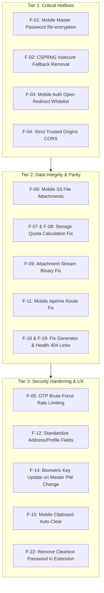

# 🛡️ Vaultr: Exhaustive System Audit & Flaws Review

> **Generated:** 2026-08-14  
> **Scope:** Full-stack audit across Next.js Web App, React Native Expo Mobile App, MV3 Chrome Extension, Core Crypto Package (`@vaultr/core`), and PostgreSQL/MinIO Backend.

---

## 📑 Table of Contents
1. [🚨 Critical & High-Severity Security Flaws & Lockouts](#1--critical--high-severity-security-flaws--lockouts)
2. [💾 Data Integrity & Storage Quota Bugs](#2--data-integrity--storage-quota-bugs)
3. [📱 Mobile App Bugs & Offline State Flaws](#3--mobile-app-bugs--offline-state-flaws)
4. [🌐 Web App & Routing Glitches](#4--web-app--routing-glitches)
5. [🔌 Browser Extension Vulnerabilities](#5--browser-extension-vulnerabilities)
6. [🗄️ Database Schema & Cascade Inconsistencies](#6--database-schema--cascade-inconsistencies)
7. [📊 Feature Parity & Incomplete Roadmap Items](#7--feature-parity--incomplete-roadmap-items)
8. [🛠️ Recommended Prioritized Fix Matrix](#8--recommended-prioritized-fix-matrix)

---

## 1. 🚨 Critical & High-Severity Security Flaws & Lockouts

### 🔴 F-01: Master Password Change Permanently Locks User Out on Mobile
* **File:** [`mobile/src/screens/settings/AccountSettingsScreen.tsx:258-278`](file:///d:/Projects/_vaultr/mobile/src/screens/settings/AccountSettingsScreen.tsx#L258-L278)
* **Description:** When the master password is changed on mobile, `reEncryptBlobs` computes re-encrypted ciphertexts with the new key in memory. However, the update loop calls:
  ```ts
  for (const updated of reEncrypted) {
    await useVaultStore.getState().updateItem(updated.id, {
      unencryptedPayload: undefined, // ❌ updated.encryptedBlob is completely discarded!
    });
  }
  useVaultStore.setState({ masterPassword: newMasterPw, cryptoKey: newKey });
  ```
  `updateItem` only encrypts if `unencryptedPayload !== undefined`. Since it is `undefined`, no network request is sent with the new blob and the server endpoint `POST /api/vault/items/reencrypt` is never called.
* **Impact:** The local store switches to `newKey`, but all database items remain encrypted with the **old key**. On the next session unlock, **every single item fails decryption permanently (catastrophic data lockout)**.
* **Fix:** Mobile must call `POST /api/vault/items/reencrypt` with `{ items: reEncrypted }` and update local Zustand store items with the new `encryptedBlob`s.

---

### 🔴 F-02: Predictable PRNG Fallback in Core Crypto Module
* **File:** [`packages/core/src/crypto.ts:21-30`](file:///d:/Projects/_vaultr/packages/core/src/crypto.ts#L21-L30) & [`packages/core/src/generator.ts:81`](file:///d:/Projects/_vaultr/packages/core/src/generator.ts#L81)
* **Description:** `getRandomValues(len)` and `secureRandInt(max)` fall back to `Math.random()` when `globalThis.crypto?.getRandomValues` is unavailable:
  ```ts
  const arr = new Uint8Array(len);
  for (let i = 0; i < len; i++) {
    arr[i] = Math.floor(Math.random() * 256); // ❌ Insecure PRNG
  }
  return arr;
  ```
* **Impact:** `Math.random()` is not a Cryptographically Secure Pseudo-Random Number Generator (CSPRNG). Generating AES-256-GCM 12-byte IVs with `Math.random()` risks IV collision. In AES-GCM, two messages encrypted under the same key and IV allow an attacker to determine the auth key ($H$) and recover plaintext.
* **Fix:** Fail closed — throw a hard `Error("CSPRNG unavailable: crypto.getRandomValues is required")` instead of silently falling back to `Math.random()`.

---

### 🟠 F-03: Open Redirect & Session Token Leakage in Mobile Auth Callback
* **File:** [`src/app/api/auth/mobile-callback/route.ts:22-24, 46`](file:///d:/Projects/_vaultr/src/app/api/auth/mobile-callback/route.ts#L22-L24)
* **Description:** The mobile auth callback accepts an unvalidated `appUrl` query parameter:
  ```ts
  const appUrl = req.nextUrl.searchParams.get("appUrl") || "vaultr://auth-callback";
  const deepLink = `${appUrl}?token=${encodeURIComponent(token)}&id=...`;
  ```
* **Impact:** An attacker can craft a phishing link `https://vaultr.app/api/auth/mobile-callback?appUrl=https://attacker.com/steal`. If a logged-in user clicks it, the server responds with a redirect script sending the raw active session token (`token`) directly to `attacker.com`.
* **Fix:** Validate that `appUrl` starts with `vaultr://` (or `exp://` in development) against an explicit whitelist.

---

### 🟠 F-04: Arbitrary Origin Trust Disabling CORS CSRF Protection
* **File:** [`src/lib/auth/auth.ts:28-38`](file:///d:/Projects/_vaultr/src/lib/auth/auth.ts#L28-L38)
* **Description:** The `getTrustedOrigins` helper dynamically appends any client-provided `Origin` or `Referer` header to Better Auth's `trustedOrigins`:
  ```ts
  const originHeader = request.headers.get("origin") || request.headers.get("referer");
  if (originHeader && originHeader !== "null") {
    try {
      const u = new URL(originHeader);
      if (!origins.includes(u.origin)) {
        origins.push(u.origin); // ❌ Trusts ANY origin
      }
    } catch {}
  }
  ```
* **Impact:** Bypasses origin validation and opens all auth endpoints to Cross-Origin Request Forgery (CSRF) from malicious domains.
* **Fix:** Restrict `trustedOrigins` strictly to `NEXT_PUBLIC_APP_URL`, `TRUSTED_ORIGINS` env vars, and predefined application domains.

---

### 🟠 F-05: Insecure In-Memory OTP Generation & Lack of Brute-Force Rate Limiting
* **File:** [`src/lib/linkOtpStore.ts:19, 25-39`](file:///d:/Projects/_vaultr/src/lib/linkOtpStore.ts#L19)
* **Description:**
  1. The 6-digit linking OTP uses `Math.random()`: `Math.floor(100000 + Math.random() * 900000)`.
  2. Failed OTP attempts do NOT increment a failure counter or lock the code.
* **Impact:** An attacker can make 1,000,000 automated POST attempts to `/api/settings/link-password/verify` within the 10-minute validity window and brute-force the password-link OTP.
* **Fix:** Use `crypto.randomInt(100000, 1000000)` and destroy the OTP after 5 failed verification attempts.

---

## 2. 💾 Data Integrity & Storage Quota Bugs

### 🔴 F-06: Mobile File Attachments Completely Disconnected from Server S3 Storage
* **File:** [`mobile/src/screens/ItemFormScreen.tsx:205-223, 282-284`](file:///d:/Projects/_vaultr/mobile/src/screens/ItemFormScreen.tsx#L205-L223)
* **Description:** When picking an attachment on mobile, `ItemFormScreen` saves local device URIs (`file:///data/...` or `content://...`) inside the unencrypted payload JSON string:
  ```ts
  if (attachments.length > 0) {
    unencryptedPayload.attachments = attachments; // ❌ Only contains local file URI!
  }
  ```
  The mobile app **never** encrypts the binary file or uploads it to `POST /api/vault/attachments`.
* **Impact:**
  1. Files attached on mobile cannot be downloaded on web or other mobile devices.
  2. As soon as the mobile device clears its temp/cache directory, the local URI becomes a broken link.
  3. Files attached on the web are never fetched or displayed in mobile `ItemDetailScreen`.
* **Fix:** Implement client-side binary AES-GCM encryption on mobile, upload via `POST /api/vault/attachments`, and stream downloads via `/api/vault/attachments/[id]/download`.

---

### 🔴 F-07: Storage Quota Leak: DB Foreign Key Cascade Runs Before Storage Calculation
* **File:** [`src/app/api/vault/items/[id]/route.ts:91-125`](file:///d:/Projects/_vaultr/src/app/api/vault/items/%5Bid%5D/route.ts#L91-L125)
* **Description:** In `DELETE /api/vault/items/[id]`:
  ```ts
  // Step 1: Delete vault item
  await db.delete(vaultItems).where(...); // ⚡ Triggers Postgres ON DELETE CASCADE on vault_attachments!

  // Step 2: Query attachment sizes
  const [sizeRow] = await db.select({ total: sum(vaultAttachments.sizeBytes) }).from(vaultAttachments)...;
  const totalAttachmentBytes = Number(sizeRow?.total ?? 0); // ❌ ALWAYS 0 because rows were deleted in Step 1!
  ```
* **Impact:** `userProfiles.storageUsedBytes` is **never decremented** when a vault item with attachments is deleted. Over time, user storage perpetually fills up until reaching the 100MB cap, preventing further uploads.
* **Fix:** Query `sum(vaultAttachments.sizeBytes)` and delete S3 objects **before** executing `db.delete(vaultItems)`.

---

### 🔴 F-08: Batch Purge Never Decrements User Storage Quota
* **File:** [`src/app/api/vault/items/batch/route.ts:67-86`](file:///d:/Projects/_vaultr/src/app/api/vault/items/batch/route.ts#L67-L86)
* **Description:** When batch action is `"purge"`, the handler deletes S3 files and deletes `vaultItems`, but completely omits decrementing `userProfiles.storageUsedBytes`.
* **Impact:** Emptying trash or mass-deleting items permanently leaks user storage quota.
* **Fix:** Sum attachment bytes for all `ownedIds` and subtract from `userProfiles.storageUsedBytes`.

---

### 🟠 F-09: Binary Ciphertext Corruption in S3 Attachment Download Stream
* **File:** [`src/lib/storage.ts:167-175`](file:///d:/Projects/_vaultr/src/lib/storage.ts#L167-L175) & [`src/app/api/vault/attachments/[id]/download/route.ts:45-51`](file:///d:/Projects/_vaultr/src/app/api/vault/attachments/%5Bid%5D/download/route.ts#L45-L51)
* **Description:** In `getAttachmentContent`:
  ```ts
  const data = await response.Body?.transformToString(); // ❌ Converts arbitrary binary to UTF-8
  ```
  `transformToString()` assumes valid UTF-8. Binary ciphertext contains invalid UTF-8 sequences which are replaced with `\uFFFD` (replacement character).
* **Impact:** When the client attempts AES-GCM decryption, authentication tag verification fails with a decryption error on non-ASCII attachments.
* **Fix:** Return raw `Uint8Array` / `Buffer` or stream `response.Body` directly as `application/octet-stream`.

---

### 🟡 F-10: Orphaned S3 Files on Account Deletion & Scheduled Vault Wipe
* **File:** [`src/app/api/settings/delete-account/route.ts:15-25`](file:///d:/Projects/_vaultr/src/app/api/settings/delete-account/route.ts#L15-L25) & [`src/app/api/vault/items/route.ts:111-120`](file:///d:/Projects/_vaultr/src/app/api/vault/items/route.ts#L111-L120)
* **Description:** Deleting an account or running scheduled 24-hour vault wipe deletes database rows, but never deletes user avatars from `avatars/` bucket or file attachments from `vault-attachments/` MinIO bucket.
* **Impact:** S3/MinIO bucket accumulates orphaned encrypted blobs and avatars indefinitely.
* **Fix:** Call `deleteAvatar(user.id)` and iterate user attachment S3 keys to purge bucket objects.

---

## 3. 📱 Mobile App Bugs & Offline State Flaws

### 🔴 F-11: Mobile Sync Profile Calls Non-Existent Endpoint
* **File:** [`mobile/src/store/vaultStore.ts:141`](file:///d:/Projects/_vaultr/mobile/src/store/vaultStore.ts#L141)
* **Description:** `syncUserProfile` attempts to fetch user info from `${cleanUrl}/api/auth/me`. The actual server route is `/api/me`.
* **Impact:** Returns 404 on every app startup, preventing mobile from syncing avatar and profile updates from the web.
* **Fix:** Change URL to `${cleanUrl}/api/me`.

---

### 🟠 F-12: Address & Profile Field Discrepancies Between Web and Mobile
* **Files:** [`mobile/src/screens/ItemFormScreen.tsx:267-278`](file:///d:/Projects/_vaultr/mobile/src/screens/ItemFormScreen.tsx#L267-L278) vs. [`src/components/vault/NewEntryDialog.tsx:53-63`](file:///d:/Projects/_vaultr/src/components/vault/NewEntryDialog.tsx#L53-L63)
* **Description:**
  * **Address:** Mobile saves `{ street, city, state, zip, country }`. Web saves `{ line1, line2, city, state, zip, country }`.
  * **Profile:** Mobile saves `{ firstName, lastName, email, phone }`. Web saves `{ fullName, dob, idNumber, email, phone }`.
* **Impact:** An address or profile created on mobile displays blank street/name fields on the web app, and vice versa.
* **Fix:** Standardize on `{ line1, line2 }` and `{ fullName, firstName, lastName }` across both platforms with backwards-compatibility normalizers in `@vaultr/core`.

---

### 🟠 F-13: Offline Queue Drops Pending Updates on Temporary ID Collision & Wipes Queue on Partial Failure
* **File:** [`mobile/src/services/sync.ts:65-85`](file:///d:/Projects/_vaultr/mobile/src/services/sync.ts#L65-L85)
* **Description:**
  1. If an item is created offline (assigned `temp_123`), subsequent offline edits record updates referencing `temp_123`. When syncing online, `createItem` gets a new server UUID, but subsequent updates still attempt to patch `temp_123`, failing with 404.
  2. `flushOfflineQueue` clears `AsyncStorage.removeItem(QUEUE_KEY)` at the end even if individual items threw network errors.
* **Impact:** Offline edits made to newly created items are permanently lost.
* **Fix:** Maintain an ID mapping table during queue flush and only remove successfully executed operations from the queue.

---

### 🟡 F-14: Biometric Credential Desynchronization on Master Password Change
* **File:** [`mobile/src/screens/settings/AccountSettingsScreen.tsx:270`](file:///d:/Projects/_vaultr/mobile/src/screens/settings/AccountSettingsScreen.tsx#L270) & [`mobile/src/services/biometrics.ts:60`](file:///d:/Projects/_vaultr/mobile/src/services/biometrics.ts#L60)
* **Description:** When the master password is changed in settings, `SecureStore`'s `vaultr_master_password` key is not updated with `newMasterPw`.
* **Impact:** Biometric unlock retrieves the stale master password, causing subsequent biometric unlocks to fail with decryption errors.
* **Fix:** Call `SecureStore.setItemAsync("vaultr_master_password", newMasterPw)` if `isBiometricEnabled()` is true.

---

### 🟡 F-15: Inert Clipboard Auto-Clear Timeout on Mobile
* **Files:** [`mobile/src/screens/settings/SecuritySettingsScreen.tsx:20, 85`](file:///d:/Projects/_vaultr/mobile/src/screens/settings/SecuritySettingsScreen.tsx#L20), [`mobile/src/screens/ItemDetailScreen.tsx:75`](file:///d:/Projects/_vaultr/mobile/src/screens/ItemDetailScreen.tsx#L75)
* **Description:** Mobile allows users to select 30s/60s clipboard clear timeout and saves it in `AsyncStorage`, but neither `ItemDetailScreen` nor `TotpCode` ever reads the setting or schedules a timer to clear `Clipboard`.
* **Impact:** Copied passwords remain in Android system clipboard indefinitely.
* **Fix:** Create a centralized `useClipboardWithAutoClear` hook on mobile.

---

### 🟡 F-16: N+1 Sequential Requests on Mobile Empty Trash & Restore All
* **File:** [`mobile/src/screens/TrashScreen.tsx:61-64, 92-95`](file:///d:/Projects/_vaultr/mobile/src/screens/TrashScreen.tsx#L61-L64)
* **Description:** Restoring all items or emptying trash loops over `trashedItems` calling individual `deleteItem(item.id)` / `restoreItem(item.id)` sequentially.
* **Impact:** Triggers dozens of HTTP requests sequentially, causing UI lag and potential 429 rate-limit errors.
* **Fix:** Call `api.batchAction("restore", ids)` and `api.batchAction("purge", ids)`.

---

### 🟡 F-17: SettingsScreen "Autofill" and "Import/Export" Blocked by Coming Soon Stubs
* **File:** [`mobile/src/screens/SettingsScreen.tsx:153-195`](file:///d:/Projects/_vaultr/mobile/src/screens/SettingsScreen.tsx#L153-L195)
* **Description:**
  1. Android Native Autofill (`VaultrAutofillService.kt` and `services/autofill.ts`) is fully implemented, but `SettingsScreen` shows a "Coming Soon" alert instead of calling `openAutofillSettings()`.
  2. `DataScreen.tsx` is built in navigation, but `SettingsScreen` shows a "Coming Soon" alert instead of navigating to `DataSettings`.
* **Fix:** Replace placeholder alerts with `openAutofillSettings()` and `navigation.navigate("DataSettings")`.

---

## 4. 🌐 Web App & Routing Glitches

### 🔴 F-18: Broken Sidebar, Layout & Command Palette Links to `/vault/generator` (404 Error)
* **Files:** [`src/components/layout/Sidebar.tsx:625`](file:///d:/Projects/_vaultr/src/components/layout/Sidebar.tsx#L625), [`src/components/layout/CommandPalette.tsx:133`](file:///d:/Projects/_vaultr/src/components/layout/CommandPalette.tsx#L133), [`src/app/vault/layout.tsx:58`](file:///d:/Projects/_vaultr/src/app/vault/layout.tsx#L58)
* **Description:** The generator link in the sidebar, command palette, and TopBar redirects to `/vault/generator`. The actual Next.js page route is `/generator` (`src/app/generator/page.tsx`).
* **Impact:** Clicking "Generator" in the desktop sidebar or TopBar navigates to a **404 Not Found** page.
* **Fix:** Update all links to `/generator` or add a rewrite in `next.config.ts`.

---

### 🔴 F-19: Broken Mobile Web Bottom Nav Links to Non-Existent `/health` Route
* **File:** [`src/components/layout/BottomNav.tsx:10`](file:///d:/Projects/_vaultr/src/components/layout/BottomNav.tsx#L10)
* **Description:** `BottomNav` contains a tab `{ href: "/health", label: "Health" }`. There is no `/health` page in `src/app`.
* **Impact:** Tapping "Health" on mobile web browsers opens a 404 page.
* **Fix:** Route to `/vault/authenticator` (or build `/vault/health` dashboard).

---

### 🟠 F-20: Command Palette "Password Health" Navigates to Authenticator
* **File:** [`src/components/layout/CommandPalette.tsx:131`](file:///d:/Projects/_vaultr/src/components/layout/CommandPalette.tsx#L131)
* **Description:** The Command Palette item labeled `"Password Health"` runs `router.push("/vault/authenticator")`.
* **Impact:** Confuses users expecting a password health score / breach overview.
* **Fix:** Point to the dedicated Password Health screen once implemented.

---

### 🟡 F-21: SSR `window.crypto` Reference Error in `src/lib/totp.ts`
* **File:** [`src/lib/totp.ts:81, 91`](file:///d:/Projects/_vaultr/src/lib/totp.ts#L81)
* **Description:** Directly accesses `window.crypto.subtle` without checking `typeof window !== "undefined"` or using `globalThis.crypto`.
* **Impact:** Throws `ReferenceError: window is not defined` if evaluated in server components, SSR passes, or Node worker threads.
* **Fix:** Use `@noble/hashes` from `@vaultr/core` or `globalThis.crypto?.subtle`.

---

## 5. 🔌 Browser Extension Vulnerabilities

### 🟠 F-22: Plaintext Master Password Storage in `chrome.storage.local`
* **File:** [`extension/src/background/service-worker.ts:67, 94-95`](file:///d:/Projects/_vaultr/extension/src/background/service-worker.ts#L67)
* **Description:** When extension auto-lock is set to `"0"` ("Never Lock"), the background service worker saves the master password in cleartext into `chrome.storage.local` (`vaultr_master_password_persisted`).
* **Impact:** Any local disk inspection, browser debugging tool, or extension vulnerability exposes the user's master password in cleartext.
* **Fix:** Never persist plaintext master passwords to disk. When "Never Lock" is selected, persist only the derived `CryptoKey` in session memory (`chrome.storage.session`).

---

## 6. 🗄️ Database Schema & Cascade Inconsistencies

### 🟠 F-23: Missing Foreign Key Cascades on Better Auth Session and Account Tables
* **File:** [`src/db/schema.ts:45, 52, 77`](file:///d:/Projects/_vaultr/src/db/schema.ts#L45)
* **Description:** `session.userId`, `account.userId`, `twoFactor.userId`, and `userProfiles.userId` lack `{ onDelete: 'cascade' }` in Drizzle definitions.
* **Impact:** Deleting a user row via `db.delete(user)` can fail with a Postgres foreign key violation constraint error if active sessions or accounts exist.
* **Fix:** Add `{ onDelete: 'cascade' }` to all child foreign key references to `user.id`.

---

### 🟡 F-24: Self-Revocation ID Mismatch in `DELETE /api/settings/sessions/[id]`
* **File:** [`src/app/api/settings/sessions/[id]/route.ts:24`](file:///d:/Projects/_vaultr/src/app/api/settings/sessions/%5Bid%5D/route.ts#L24)
* **Description:** `verifyUserToken` provides `me.sessionId` (the raw session token string), whereas the URL param `id` is the database primary key UUID. Line 24 checks `if (sessionId === me.sessionId)`.
* **Impact:** The self-revocation guard evaluates to `false`, allowing a user to accidentally delete their current active session via the single-delete route.
* **Fix:** Use `resolveSessionId(me.sessionId)` to compare DB primary keys.

---

## 7. 📊 Feature Parity & Incomplete Roadmap Items

| Feature | Web App | Mobile App | Extension | Status / Roadmap |
|---|---|---|---|---|
| **Encrypted File Attachments** | ✅ MinIO S3 upload & download | ❌ Local file path stub (Not uploaded) | ❌ Not supported | **High Priority Gap** |
| **Password Health Dashboard** | ⚠️ Component in item preview | ❌ Missing | ❌ Missing | Roadmap Sprint 5 |
| **Data Import (Bitwarden/1Pass/CSV)**| ✅ PapaParse CSV + Bitwarden JSON | ❌ Stub UI ("Coming Soon") | ❌ Not supported | **High Priority Gap** |
| **Data Export** | ✅ Real `.json`/`.csv` file download | ⚠️ Dumps raw text into clipboard | ❌ Not supported | Security & UX Gap |
| **Multi-Select Bulk Actions** | ✅ Checkboxes + Batch API | ❌ Single-item only | ❌ Single-item only | Mobile UX Gap |
| **Audit Logs Viewer** | ⚠️ DB Table exists (`audit_logs`) | ❌ Missing | ❌ Missing | Roadmap Sprint 12 |
| **In-App Notification Center** | ⚠️ Bell in top bar, no dropdown | ❌ Missing | ❌ Missing | Roadmap Sprint 13 |
| **Android Native Autofill Bridge** | ➖ N/A | ✅ Native Kotlin Module | ✅ DOM Content Script | Wire to Settings UI |
| **Biometric Hardware Unlock** | ➖ WebAuthn (Planned) | ✅ SecureStore + Fingerprint/Face | ➖ Planned | Mobile Complete |

---

## 8. 🛠️ Recommended Prioritized Fix Matrix



1. **Step 1:** Apply **Tier 1 Critical Hotfixes** (Fix mobile master password re-encryption data loss, remove `Math.random` fallback in core crypto, and secure auth callbacks).
2. **Step 2:** Apply **Tier 2 Data Integrity & Navigation Fixes** (Correct S3 storage decrement order, fix binary attachment streaming, fix `/api/me` mobile endpoint, and fix broken 404 routes `/vault/generator` and `/health`).
3. **Step 3:** Apply **Tier 3 Security Hardening & Parity** (Replace mobile clipboard export with real file export via `expo-file-system`, harmonize address/profile field schemas, and link Android Autofill directly in settings).
