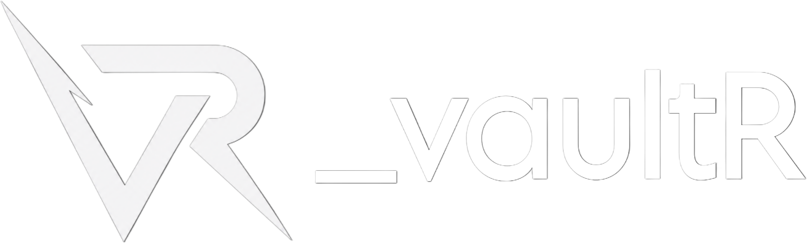
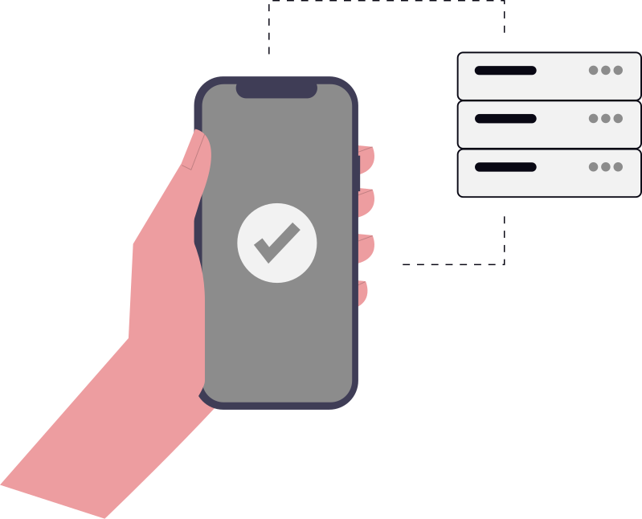

<div align="center">

  <picture>
    <source media="(prefers-color-scheme: dark)" srcset="public/brand/vaultr-full-dark-transparent.png">
    <source media="(prefers-color-scheme: light)" srcset="public/brand/vaultr-full-light-transparent.png">
    
  </picture>

  <p align="center">
    <strong>The Sovereign, Zero-Knowledge Password & Secrets Manager for Modern Workflows.</strong><br>
    <em>Client-Side AES-256-GCM • Multi-Platform Sync • Native Android Autofill • Docker Self-Hosting</em>
  </p>

  <p align="center">
    <a href="https://github.com"></a>
    <a href="LICENSE"></a>
    <a href="https://nextjs.org/"></a>
    <a href="https://react.dev/"></a>
    <a href="https://www.typescriptlang.org/"></a>
    <a href="https://www.docker.com/"></a>
    <a href="#-security-architecture"></a>
  </p>

  <p align="center">
    <a href="#-why-vaultr">Why VaultR</a> •
    <a href="#-key-capabilities">Key Capabilities</a> •
    <a href="#-security-architecture">Security Architecture</a> •
    <a href="#-cross-platform-ecosystem">Ecosystem</a> •
    <a href="#-self-hosting--quickstart">Quickstart</a> •
    <a href="#-local-development">Development</a>
  </p>

</div>

---

## 🌟 Why VaultR?

Most password managers force a compromise between **convenience** and **sovereignty**. **VaultR 2026** eliminates that trade-off by combining zero-knowledge client-side encryption with a responsive, high-aesthetic user experience across web, mobile, and browser clients.

<table>
  <tr>
    <td width="33%" align="center" valign="top">
      <br>
      <strong>Zero-Knowledge Core</strong><br>
      <sub>Master passwords never leave your browser or device. All encryption occurs in memory via WebCrypto SubtleCrypto.</sub>
    </td>
    <td width="33%" align="center" valign="top">
      <br>
      <strong>Native Android Autofill</strong><br>
      <sub>Instant biometric unlock, dropdown overlays, and inline keyboard suggestion chips for Gboard and Samsung Keyboard.</sub>
    </td>
    <td width="33%" align="center" valign="top">
      <br>
      <strong>1-Command Self-Hosting</strong><br>
      <sub>Fully self-contained Docker Compose bundle with PostgreSQL and MinIO S3-compatible attachment storage.</sub>
    </td>
  </tr>
</table>

---

## ✨ Key Capabilities

### 🛡️ Cryptographic Rigor
* **AES-256-GCM Binary Encryption**: Authenticated ciphers with 128-bit integrity authentication tags and unique 96-bit random Initialization Vectors (IVs) per item.
* **PBKDF2-SHA256 Key Derivation**: Master keys derived locally with 100,000 rounds and cryptographically secure per-user salts.
* **Non-Extractable CryptoKeys**: Derived keys reside purely in ephemeral memory and cannot be exported by rogue scripts or browser memory dumps.
* **Trial-Decryption Validation**: Local trial decryption determines password validity instantly without sending hashes to the backend.

### 🗄️ Multi-Tier Organization & Ergonomics
* **Hierarchical Folder Trees**: Recursive folder organization with nested subfolders, live entry counters, and collapse/expand persistence.
* **Multi-Type Vault Items**: First-class schemas for **Logins**, **Payment Cards**, **Secure Notes**, **Server/API Credentials**, and **Personal Identities**.
* **Real-Time Card Detection**: Auto-detects Visa, Mastercard, American Express, Discover, and RuPay with live interactive card preview canvases.
* **Command Palette (`⌘K` / `Ctrl+K`)**: Rapid fuzzy search across vault items, folders, custom tags, and navigation with live side-by-side credential previews.

### ⏱️ Integrated 2FA Authenticator & Password Generator
* **RFC 6238 TOTP Engine**: Dynamic 30-second time-based one-time password generation with live circular countdown sync rings.
* **Camera QR Scanner**: 1-tap QR scanner to import 2FA seeds from physical screens or documents directly into credentials.
* **Entropy & Crack-Time Scoring**: Real-time password strength analysis with visual scoring meter.
* **Continuous Syntax Highlighting**: Monospace visual color differentiation for uppercase, lowercase, numbers, and symbols.
* **Diceware Passphrase Engine**: Memorable multi-word passphrases with custom separators and word capitalization.

### 📱 Tablet & Landscape Command Canvas
* **Responsive Multi-Pane Dashboards**: Purpose-built split-view layouts for tablets, foldables, and wide desktop displays.
* **Compact Navigation Dock**: Minimal 72px tablet rail with vertical tab grouping and one-touch emergency lock.

---

## 🛡️ Security Architecture

```
┌────────────────────────────────────────────────────────────────────────┐
│                       CLIENT DEVICE (BROWSER / APP)                    │
│                                                                        │
│  User Master Password ──► PBKDF2-SHA256 (100,000 Rounds + Salt)        │
│                                     │                                  │
│                                     ▼                                  │
│                             Master CryptoKey                           │
│                                     │                                  │
│  Plaintext Payload ────► AES-256-GCM Encrypt (Unique 96-bit IV)        │
│                                     │                                  │
└─────────────────────────────────────┼──────────────────────────────────┘
                                      │  (Encrypted Ciphertext + IV Only)
                                      ▼
┌────────────────────────────────────────────────────────────────────────┐
│                        VAULTR SERVER (POSTGRESQL)                      │
│                                                                        │
│  • Stored Records: Encrypted Blobs, IVs, Password Salts, Metadata      │
│  • Zero knowledge of master password or plaintext credentials          │
│  • Mathematically impossible to decrypt data without user's key        │
└────────────────────────────────────────────────────────────────────────┘
```

---

## 🌐 Cross-Platform Ecosystem

| Platform | Technology | Status | Key Capabilities |
| :--- | :--- | :---: | :--- |
| **Web Dashboard** | Next.js 15 (App Router), React 19, Tailwind CSS |  | Command palette, card canvas, TOTP manager, admin panel |
| **Mobile App** | React Native, Expo 57, TurboModules |  | Android Autofill Service, Gboard chips, Biometrics, Tablet canvas |
| **Browser Extension** | TypeScript, Webpack 5, Manifest V3 |  | Contextual autofill, quick generator, popup search |
| **Core Library** | `@vaultr/core` (Universal TypeScript) |  | Shared crypto routines, schema validators, version constants |

---

## 🚀 Self-Hosting & Quickstart

Deploy your private VaultR instance with Docker in under 2 minutes:

### 1. Prerequisites
- [Docker Engine](https://docs.docker.com/engine/install/) (v24.0+)
- [Docker Compose](https://docs.docker.com/compose/install/) (v2.0+)

### 2. Clone & Configure
```bash
git clone https://github.com/your-username/vaultr.git
cd vaultr

# Copy environment template
cp .env.example .env
```

### 3. Generate Secret Key
Generate a strong 64-byte secret key:
```bash
# Using openssl
openssl rand -base64 64

# Or using Node.js
node -e "console.log(require('crypto').randomBytes(64).toString('base64'))"
```
Paste this value into `BETTER_AUTH_SECRET` inside `.env`.

### 4. Start Containers
```bash
docker compose up -d --build
```

- 🌐 **Web Dashboard**: `http://localhost:3005`
- 🗄️ **MinIO S3 Storage Console**: `http://localhost:9011`

### 5. Create Administrator Account
1. Open `http://localhost:3005` and register your first account.
2. Grant administrator access via CLI:
   ```bash
   docker compose exec app node scripts/make-admin.js your.email@example.com
   ```
3. Log out and log back in to access the `/admin` control panel.

---

## 💻 Local Development

### 1. Monorepo Setup
```bash
# Install root and workspace dependencies
npm install

# Start PostgreSQL and MinIO backing containers
docker compose up -d postgres minio

# Run database schema migrations
npm run db:migrate
```

### 2. Running Web Application
```bash
npm run dev
# Running at http://localhost:3000
```

### 3. Running Mobile Client
```bash
cd mobile
npm start

# Run on Android emulator / connected USB device:
npm run android
```

### 4. Building Browser Extension
```bash
cd extension
npm run dev

# Packaged distribution will be created in extension/dist/
# Load unpacked in chrome://extensions with Developer Mode enabled.
```

---

## 📁 Repository Structure

```
_vaultr/
├── packages/
│   └── core/                 # Shared cryptographic engine & schemas (@vaultr/core)
│       └── src/
│           ├── index.ts
│           └── version.ts    # Single source of truth for versioning & build metadata
├── src/                      # Next.js 15 Web Application
│   ├── app/                  # App Router views & REST APIs
│   │   ├── (auth)/           # Authentication, reset password & OAuth callback
│   │   ├── admin/            # Administrative management center
│   │   ├── api/              # Secure API endpoints
│   │   ├── vault/            # Interactive dashboard, TOTP & generator
│   │   ├── docs/             # Public documentation hub
│   │   └── changelog/        # Release history & milestone notes
│   ├── components/           # UI components, dialogs & navigation bars
│   ├── context/              # React Context Providers (Vault, Auth, Theme)
│   ├── db/                   # Drizzle ORM schema & client configuration
│   ├── hooks/                # React hooks (useCrypto, useAutoLock, useToast)
│   └── lib/                  # Auth, S3 storage, audit logging & encryption helpers
├── mobile/                   # React Native & Expo Mobile Client
│   ├── android/              # Native Android wrapper & Autofill Service
│   └── src/
│       ├── navigation/       # Responsive navigation & tablet dock
│       ├── screens/          # Mobile views & form canvases
│       └── services/         # Native autofill, biometrics & offline sync
├── extension/                # Browser Extension (Manifest V3)
│   └── src/                  # Service worker, popup UI & autofill content scripts
├── drizzle/                  # PostgreSQL migration files
├── docker-compose.yml        # Multi-container self-hosting specification
└── Dockerfile                # Multi-stage production container build
```

---

## 📄 License & Security Disclosures

* **License**: Distributed under the [MIT License](LICENSE).
* **Security**: To report vulnerabilities or security concerns, please review our [Security Policy](/security) or contact security maintainers directly.

<div align="center">
  <sub>Built with precision for privacy, speed, and cryptographic sovereignty.</sub>
</div>
